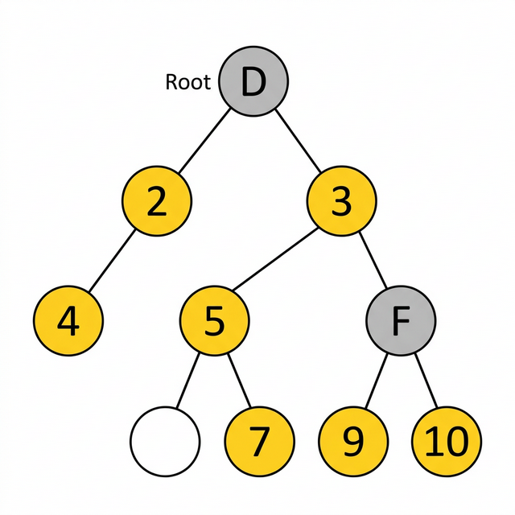

# 4.

## โจทย์: ให้เขียนภาษาโปรแกรมอะไรก็ได้หรือ Pseudocode หาผลรวมของตัวเลขใน Tree นี้

> 📄 ซอร์สโค้ด: [index.js](index.js)



## แนวคิด

- ใช้ **DFS (Depth First Search)** วน traverse ทุก node ใน Tree
- ถ้า node เป็น **ตัวเลข** → นับรวม
- ถ้า node เป็น **ตัวอักษร** (D, F) → ข้ามไป

## Pseudocode

```
function sumNumbers(node):
    if node is null then return 0

    if node.value is number then
        sum = node.value
    else
        sum = 0

    for each child in node.children:
        sum = sum + sumNumbers(child)

    return sum
```

## ผลลัพธ์จากการ run โปรแกรม (JavaScript)

```
=== โครงสร้าง Tree ===

D (ข้าม)
  2 ✅
    4 ✅
  3 ✅
    5 ✅
      7 ✅
      9 ✅
    F (ข้าม)
      10 ✅

=== ตัวเลขที่นับ ===
2 + 3 + 4 + 5 + 7 + 9 + 10

=== คำตอบ ===
ผลรวม = 40
```

## คำตอบ: `ผลรวม = 40`
