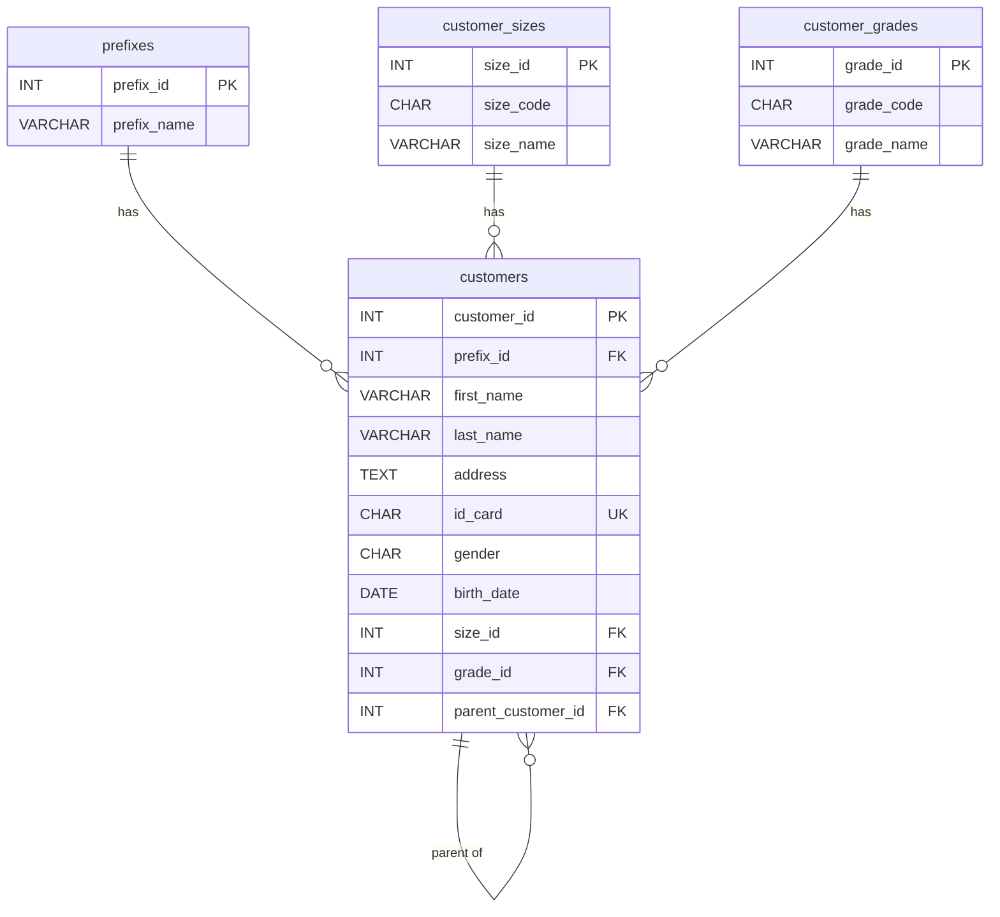

# 5.

## โจทย์: Design และ Normalization Database Table ข้อมูลลูกค้า

> ER Diagram: [er-diagram.drawio](er-diagram.drawio)


**Fields**: รหัส, คำนำหน้า, ชื่อ, สกุล, ที่อยู่, บัตร ปชช, เพศ, วันเกิด, ขนาดลูกค้า(S,M,B), เกรดลูกค้า(A,B,C,D)

**เงื่อนไข**: ลูกค้าบางรายอาจจะ **เป็นลูกค้าย่อยของลูกค้าหลัก** ได้

---

## แนวคิดการ Normalization

### ก่อน Normalize (ทุกอย่างอยู่ในตารางเดียว)

| customer_id | prefix | first_name | last_name | address       | id_card       | gender | birth_date | size | grade | parent_customer_id |
| ----------- | ------ | ---------- | --------- | ------------- | ------------- | ------ | ---------- | ---- | ----- | ------------------ |
| 1           | นาย    | สมชาย      | ใจดี      | 123 กรุงเทพ   | 1234567890123 | M      | 1990-01-01 | S    | A     | NULL               |
| 2           | นาง    | สมหญิง     | รักดี     | 456 เชียงใหม่ | 9876543210987 | F      | 1992-05-15 | M    | B     | 1                  |

### ปัญหา

- `prefix` (คำนำหน้า) มีค่าซ้ำๆ (นาย, นาง, นางสาว) → ควรแยกเป็นตาราง
- `size` และ `grade` เป็นค่าคงที่ที่มีจำกัด → ควรแยกเป็นตาราง lookup
- `address` อาจซ้ำได้ → สามารถแยกย่อยได้ถ้าต้องการ Normalize ระดับสูง

---

## หลัง Normalize — ออกแบบ 4 ตาราง

### 1. ตาราง `prefixes` (คำนำหน้า)

| Column      | Type        | Description                     |
| ----------- | ----------- | ------------------------------- |
| prefix_id   | INT (PK)    | รหัสคำนำหน้า                    |
| prefix_name | VARCHAR(20) | ชื่อคำนำหน้า (นาย, นาง, นางสาว) |

### 2. ตาราง `customer_sizes` (ขนาดลูกค้า)

| Column    | Type        | Description                   |
| --------- | ----------- | ----------------------------- |
| size_id   | INT (PK)    | รหัสขนาด                      |
| size_code | CHAR(1)     | รหัสย่อ (S, M, B)             |
| size_name | VARCHAR(50) | ชื่อเต็ม (Small, Medium, Big) |

### 3. ตาราง `customer_grades` (เกรดลูกค้า)

| Column     | Type        | Description          |
| ---------- | ----------- | -------------------- |
| grade_id   | INT (PK)    | รหัสเกรด             |
| grade_code | CHAR(1)     | รหัสย่อ (A, B, C, D) |
| grade_name | VARCHAR(50) | ชื่อเต็ม             |

### 4. ตาราง `customers` (ลูกค้า)

| Column             | Type                       | Description                    |
| ------------------ | -------------------------- | ------------------------------ |
| customer_id        | INT (PK)                   | รหัสลูกค้า                     |
| prefix_id          | INT (FK → prefixes)        | คำนำหน้า                       |
| first_name         | VARCHAR(100)               | ชื่อ                           |
| last_name          | VARCHAR(100)               | สกุล                           |
| address            | TEXT                       | ที่อยู่                        |
| id_card            | CHAR(13) UNIQUE            | บัตรประชาชน                    |
| gender             | CHAR(1)                    | เพศ (M/F)                      |
| birth_date         | DATE                       | วันเกิด                        |
| size_id            | INT (FK → customer_sizes)  | ขนาดลูกค้า                     |
| grade_id           | INT (FK → customer_grades) | เกรดลูกค้า                     |
| parent_customer_id | INT (FK → customers) NULL  | ลูกค้าหลัก (ถ้าเป็นลูกค้าย่อย) |

> **จุดสำคัญ**: `parent_customer_id` เป็น **Self-Referencing Foreign Key** ชี้กลับไปที่ตาราง `customers` เอง
>
> - ถ้า `NULL` = เป็นลูกค้าหลัก
> - ถ้ามีค่า = เป็นลูกค้าย่อยของลูกค้ารหัสนั้น

---

## ER Diagram



---

## SQL สร้างตาราง

```sql
CREATE TABLE prefixes (
    prefix_id INT PRIMARY KEY AUTO_INCREMENT,
    prefix_name VARCHAR(20) NOT NULL
);

CREATE TABLE customer_sizes (
    size_id INT PRIMARY KEY AUTO_INCREMENT,
    size_code CHAR(1) NOT NULL UNIQUE,
    size_name VARCHAR(50) NOT NULL
);

CREATE TABLE customer_grades (
    grade_id INT PRIMARY KEY AUTO_INCREMENT,
    grade_code CHAR(1) NOT NULL UNIQUE,
    grade_name VARCHAR(50) NOT NULL
);

CREATE TABLE customers (
    customer_id INT PRIMARY KEY AUTO_INCREMENT,
    prefix_id INT NOT NULL,
    first_name VARCHAR(100) NOT NULL,
    last_name VARCHAR(100) NOT NULL,
    address TEXT,
    id_card CHAR(13) NOT NULL UNIQUE,
    gender CHAR(1) NOT NULL,
    birth_date DATE,
    size_id INT NOT NULL,
    grade_id INT NOT NULL,
    parent_customer_id INT NULL,
    FOREIGN KEY (prefix_id) REFERENCES prefixes(prefix_id),
    FOREIGN KEY (size_id) REFERENCES customer_sizes(size_id),
    FOREIGN KEY (grade_id) REFERENCES customer_grades(grade_id),
    FOREIGN KEY (parent_customer_id) REFERENCES customers(customer_id)
);
```

## ตัวอย่างข้อมูล

```sql
-- คำนำหน้า
INSERT INTO prefixes (prefix_name) VALUES ('นาย'), ('นาง'), ('นางสาว');

-- ขนาดลูกค้า
INSERT INTO customer_sizes (size_code, size_name) VALUES ('S', 'Small'), ('M', 'Medium'), ('B', 'Big');

-- เกรดลูกค้า
INSERT INTO customer_grades (grade_code, grade_name) VALUES ('A', 'A'), ('B', 'B'), ('C', 'C'), ('D', 'D');

-- ลูกค้าหลัก
INSERT INTO customers (prefix_id, first_name, last_name, address, id_card, gender, birth_date, size_id, grade_id, parent_customer_id)
VALUES (1, 'สมชาย', 'ใจดี', '123 กรุงเทพ', '1234567890123', 'M', '1990-01-01', 1, 1, NULL);

-- ลูกค้าย่อย (เป็นลูกค้าย่อยของ สมชาย = customer_id 1)
INSERT INTO customers (prefix_id, first_name, last_name, address, id_card, gender, birth_date, size_id, grade_id, parent_customer_id)
VALUES (2, 'สมหญิง', 'รักดี', '456 เชียงใหม่', '9876543210987', 'F', '1992-05-15', 2, 2, 1);
```
